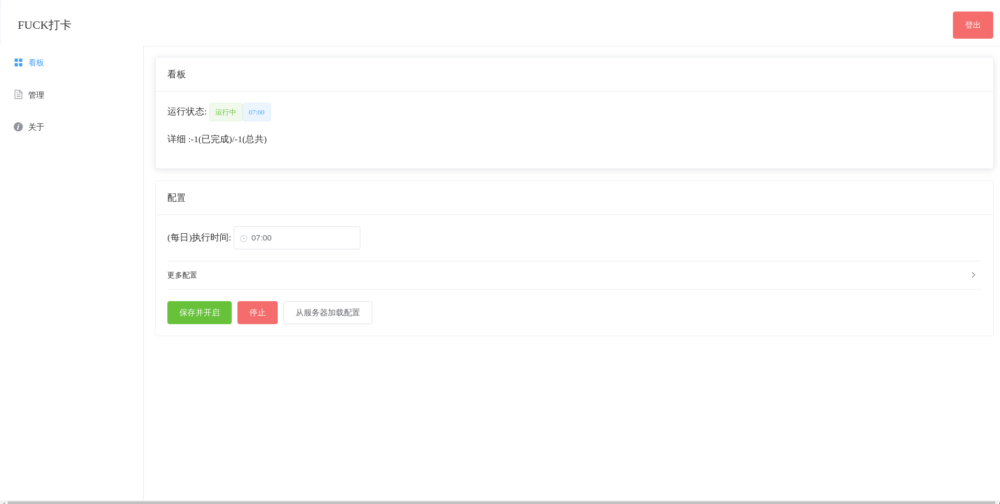
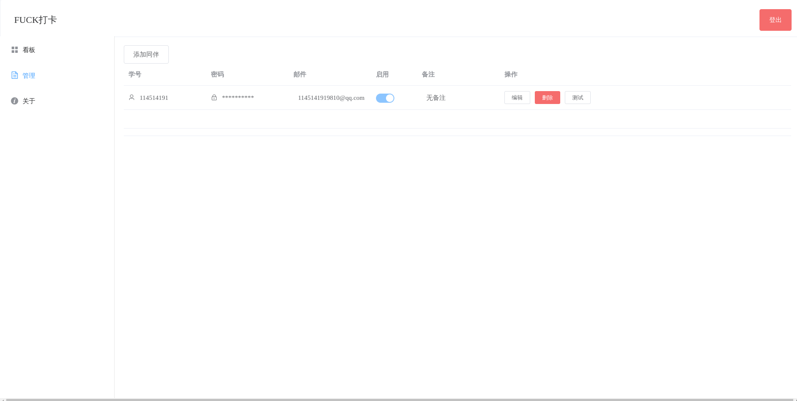

# UJS JKDK

#### 介绍
是自动打卡捏



## 快速开始

+ 环境要求：python3 nodejs

1. 将本项目克隆到本地
`git clone https://gitee.com/swetycore/ujs-jkdk.git`
2. 安装项目依赖 
  ```bash
  cd ujs-jkdk/server
  pip install -r requirements.txt
  ```
3. 设定访问KEY
`export ACCESS_KEY=admin`
3. 启动项目
`python main.py`


